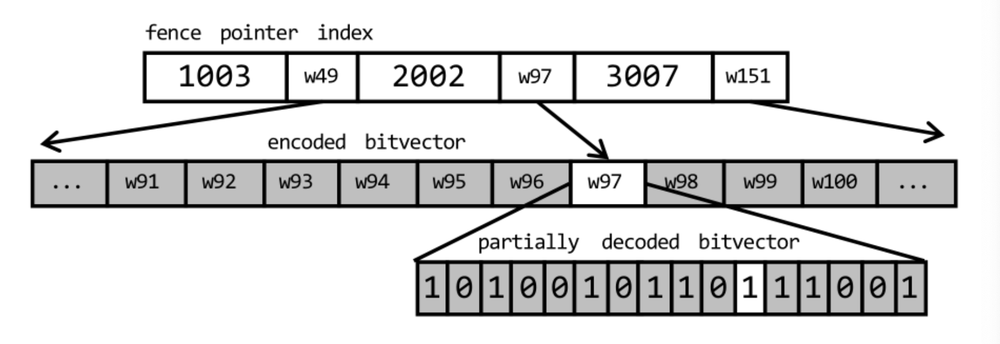
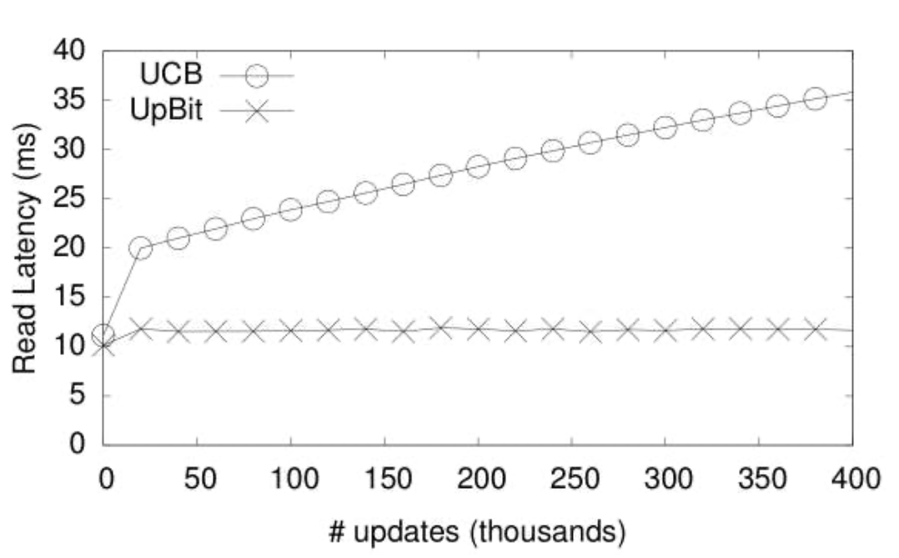

# UpBit

---

## Bitmap Overview

* Common data structure used in database implementations due to having fast read performance for common queries, such as equality and selective range queries
* Main drawback: updating bitmaps is costly
  * Requires decoding and encoding of bitvector
  
  * Without compression, bitmaps take up a lot of space
    
    * Each bitvector is $O(nd)$ space, where there are $n$ rows in the database and $d$ values for the bitvector's corresponding attribute's domain
    
  * Compression will greatly reduce space requirements, but adds overhead since the bitvector needs to be decoded for every read operation and every write operation requires both a decoding and encoding step
  
  * Uses typical run-length encoding
  
    * Example:
  
      ```
      1000001111
      > 15041
      ```
  
* We want both good read performance and data freshness

##### How Bitmaps Work

* Consists of one bitvector for each distinct value of the domain for a particular attribute $A$
* The $k$-th position of the bitvector, which corresponds to some value $v$ in the domain of $A$, is set to 1 if the $k$-th row has value $v$ for attribute $A$
* Update Conscious Bitmaps (UCB) is founded on the **existence bitvector** (EB) which determines whether or not a specific bits in the bitvectors are valid or not
  * EB is initialized to a vector of 1s
  * Read queries involve performing a bitwise AND on the value bitvector and the existence bitvector
  * Delete queries involve flipping the bit of the corresponding row in the existence vector
  * Update queries involve deleting the query row, then appending a new row to the VB and EB
    * Updates are out-of-place
  * Unfortunately, read performance does not scale with updates in UCB
    * Read latency increases by more than two times as updates are applied — more updates means that read queries becoming increasingly expensive

## UpBit Overview

* Aims to improve write performance of bitmaps without sacrificing read performance
  * Offers a scalable solution — read performance remains stable as more updates/deletes/inserts are applied to the bitmap
* Two main points:
  1. Maintain an update bitvector to keep track of updated values
     * Since update bitvectors are generally sparse, their compressed size is small
  2. Maintain **fence pointers** to allow for efficient retrieval of values at an arbitrary position in the bitmap
* Benefits:
  * Very fast equality and low selectivity queries
  * Occupies relatively little space
  * Takes advantage of parellelism

##### How UpBit Works

* **Value bitvector (VB)**: each VB stores a bit set to one at the positions having $v$ for the indexed column and zero otherwise (same as in UCBs)

  * The domain of column $A$ has $d$ unique values in its domain $D$ which correspond to $d$ value bitvectors $VB=\{V_1,\ldots,V_d\}$

* **Update bitvector (UB)**: for each VB, there is a corresponding UB

  * Every update changes the UB corresponding to the old value and another in the UB of the new value

  Aggregate size of uncompressed bitvectors for UpBit is twice as much as read-optimized bitmaps due to needing to maintain two bitvectors for each
  
  > In order to maintain high compressibility the update bitvectors are periodically merged with value bitvectors and re-initialized. When queried, UpBit combines — through a bitwise XOR — the value itvector and the corresponding update bitvector. When updated, UpBit only needs to flip two bits, one in the UB of the new value and on the UB of the old value.
  
  * Initialized to a vector of zeros
  * Current value is the XOR
  * UB and VBs are the same size — one bit per value in the domain of the corresponding attribute
  
* **Fence pointers**: used to allow efficient retrieval of arbitrary values, allowing direct access to any position of a compressed bitvector

  * Helps avoid unnecessary decodings since we can jump directly to relevant data for read queries

  * Also helps make things easier for multi-threaded implementations

  * Fence pointers **do not need to be decompressed**

  * Fence pointers point towards sections of a bitvector

    

##### Update

Suppose we have an attribute $A$ with domain values $\{10, 20, 30\}$. We have 8 rows in our database:

| RID  | A    |
| ---- | ---- |
| 1    | 30   |
| 2    | 20   |
| 3    | 30   |
| 4    | 10   |
| 5    | 20   |
| 6    | 10   |
| 7    | 30   |
| 8    | 20   |

Then we initially have the following VBs and UBs:
$$
\begin{align*}
&A=10  ~~~UB_{10} & A=20  ~~~UB_{20} & ~~~~~~~~A=30  ~~~UB_{30}\\
&~~\begin{bmatrix} 0\\0\\0\\1\\0\\1\\0\\0\end{bmatrix}
~~\begin{bmatrix} 0\\0\\0\\0\\0\\0\\0\\0\end{bmatrix}
&~~\begin{bmatrix} 0\\1\\0\\0\\1\\0\\0\\1\end{bmatrix}
~~~~\begin{bmatrix} 0\\0\\0\\0\\0\\0\\0\\0\end{bmatrix}
&~~~~~~~~~\begin{bmatrix} 1\\0\\1\\0\\0\\0\\1\\0\end{bmatrix}
~~\begin{bmatrix} 0\\0\\0\\0\\0\\0\\0\\0\end{bmatrix}
\end{align*}
$$
Suppose we update row 5 from 20 to 10. Then we XOR the corresponding row in the corresponding UB:
$$
\begin{align*}
&A=10  ~~~UB_{10} & A=20  ~~~UB_{20} & ~~~~~~~~A=30  ~~~UB_{30}\\
&~~\begin{bmatrix} 0\\0\\0\\1\\0\\1\\0\\0\end{bmatrix}
~~\begin{bmatrix} 0\\0\\0\\0\\0\\0\\0\\0\end{bmatrix}
&~~\begin{bmatrix} 0\\1\\0\\0\\1\\0\\0\\1\end{bmatrix}
~~~~\begin{bmatrix} 0\\0\\0\\0\\1\\0\\0\\0\end{bmatrix}
&~~~~~~~~~\begin{bmatrix} 1\\0\\1\\0\\0\\0\\1\\0\end{bmatrix}
~~\begin{bmatrix} 0\\0\\0\\0\\0\\0\\0\\0\end{bmatrix}
\end{align*}
$$
We flip the bit in the UB of the corresponding UB of the new value:
$$
\begin{align*}
&A=10  ~~~UB_{10} & A=20  ~~~UB_{20} & ~~~~~~~~A=30  ~~~UB_{30}\\
&~~\begin{bmatrix} 0\\0\\0\\1\\0\\1\\0\\0\end{bmatrix}
~~\begin{bmatrix} 0\\0\\0\\0\\1\\0\\0\\0\end{bmatrix}
&~~\begin{bmatrix} 0\\1\\0\\0\\1\\0\\0\\1\end{bmatrix}
~~~~\begin{bmatrix} 0\\0\\0\\0\\1\\0\\0\\0\end{bmatrix}
&~~~~~~~~~\begin{bmatrix} 1\\0\\1\\0\\0\\0\\1\\0\end{bmatrix}
~~\begin{bmatrix} 0\\0\\0\\0\\0\\0\\0\\0\end{bmatrix}
\end{align*}
$$

##### Query (Read)

Suppose we run the query `SELECT * FROM table WHERE A=20`

* Find the bitvector that corresponds to the query value (20), using the VB manager which links values to bitvectors
* Perform a bitwise XOR between the VB and its UB

##### Delete

Suppose we want to delete row 2.

* Determine what which VB has its bit flipped for each attribute
* Find the UB corresponding to that VB
* Negate the contents of that UB for that row

##### Insert

Suppose we want to insert a new row with A=20

* Find the VBs for each attribute and their corresponding UBs
* Check that there is enough space available to pad each vector
* Increase the size of the VBs and UBs, set the bit in the VB to 1

### Scalability of UpBit

* Define some threshold value $T$
* When the number of updates has exceeded $T$, mark UBs as "to be merged"
  * Merge the UB with its corresponding VB by XORing them together
  * Reinitialize the UB



##### Comparing to State of the Art

* 51-115 times faster updates than in-place updates
* 15-29 times faster than update optimized bitmap index UCB
* Almost 3 times faster in read performance of update-optimized UCBs
* Only 8% slower than read-optimized indexes
* Takes up approximately equal space as other methods when compressed

### Datasets and Benchmarks

* Compared with read-optimized bitmap indexes supporting in-place updates (FastBit)
* Synthetic datasets — integer data varying two key parameters with size $n$ and domain cardinality $d$ following either uniform or zipfian distribution
* Berkeley Earth Data
* TPC-H
* Average measured response time over ten runs
  * Mixed reads and writes
  * Only read
  * Only write

## Word Aligned Hybrid Compression

Compress 31 bits at a time

Consider two cases:

1. All bits are 0
2. At least 1 bit is 1

Each row of the compressed output contains 32 bits

* The extra bit (the signal bit)
  * 0 is the literal flag, saying that when you decompress the next 31 bits should be taken as-is
    * This is set when there is at least 1 bit that is 1
  * 1 is the fill flag — we keep reading rows of the uncompressed data until we reach a row that has a 1. this tells us that the following 31 bits follow the fill pattern. The second bit tells us if the row is filled with 1s or 0s
    * The 30 bits now represent a 30-bit integer saying how many repetitions to perform
    * If there were 4 rows that were all zeros before we reached a row with a 1 in it, then the "fill" row in the compressed output would look like `10...0100`
* Remaining 31 bits are copied directly from the uncompressed data